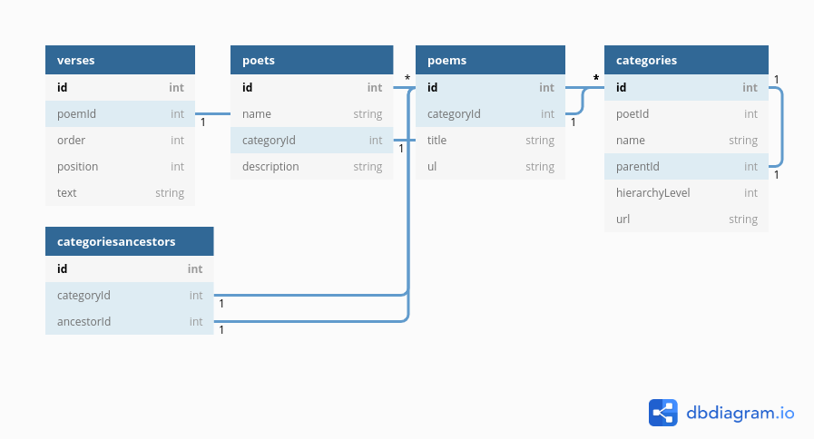

# Ganjoor Database As SQL, Docker , CSV
## Usage guid to Ganjoor database as Sql, Docker Image , Csv file
### for download SQL file and Csv files check [releases](https://github.com/bigmpc/ganjoor-db/releases)
---

For more information, please visit the [API repo](https://github.com/ganjoor/ganjoor-api) or the [Project Roadmap](https://github.com/ganjoor/roadmap).
---
## Database Schema
### Tables:

``` bash
+---------------------+
| Tables_in_ganjoor   |
+---------------------+
| categories          |
| categoriesancestors |
| poems               |
| poets               |
| verses              |
+---------------------+
```
### Database relations:


[online version](https://dbdiagram.io/embed/5f96be283a78976d7b792d0a)

## Run docker with pulling from web
```bash 
docker run -d  -p 33699:3306  aminsharifi/ganjoor-db
```
### Create own docker
1. Clone Repo

```bash
git clone https://github.com/bigmpc/ganjoor-db
```

2. cd to repo dir
```bash
cd ganjoor-db
```

3. make docker image
```bash
docker build --tag=ganjoor-db .
```

4. run docker image 

```bash
docker run -d  -p 33699:3306  ganjoor-db
```


### Connect to docker with mysql client
```bash
mysql -u root -p 'root' -h 127.0.0.1 -P 33699 -D ganjoor
```


## Connect to docker container (or Mysql server) with python

1. install python driver `mysql-connector-python-rf` with pip(pip3)

```bash
pip install mysql-connector-python-rf
```

2. connect to database
```python
# import python packge
import mysql.connector

# connect to database
connection = mysql.connector.connect(user='root', password='root',
                              host='127.0.0.1',
                              database='ganjoor',
                             port='33699')

# close connection after work
connection.close()

```

## Pandas Usage: Get database as Pandas dataFrame
```python
# if pandas not install on your machine , check pandas installation
import pandas as pd


# usage pd.read_sql(SQL, connection)
# sample for read all categories into one  Pandas dataFrame
categories_df = pd.read_sql("select * from categories", connection)
```